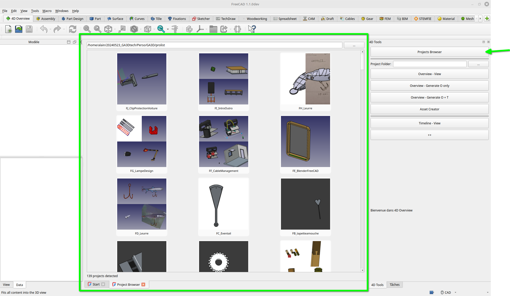
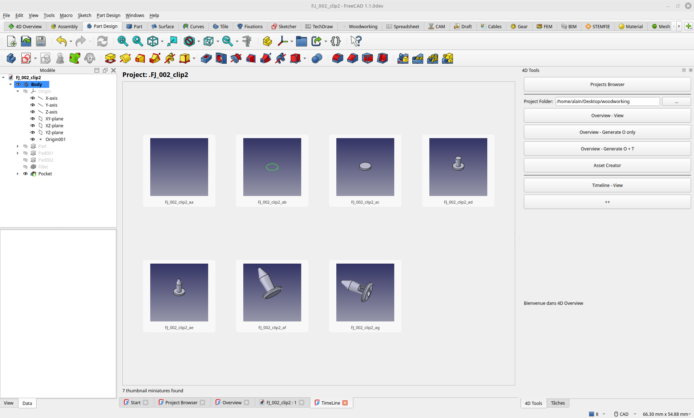

# 4DOverviewWB

4DOverview: A K.I.S.S. FreeCAD Workbench for easy **VISUAL** file management within FreeCAD, including overview, Time Travel, Assets, Bill of Process, Bill of Materials, and more. 
All features are not ready yet, this workbench is in developpement.  
The goal of this workbench is to gather, in a simple and practical way, various small macros I’ve developed over time to streamline the management of my FreeCAD projects.

## Functionalities

- **Global Project Overview**  
  Provides a visual, high-level overview of all projects stored under a structured root directory  
  (`RootFolder/[ProjectAA, ProjectAB, AC, …]`).

- **Per-Project FreeCAD Insight**  
  Displays an overview of all FreeCAD parts and assemblies contained in each project.

- **Tree Construction History Creation**  
  Generates a lightweight build/history view for individual parts.

- **Asset Reuse Tools**  
  Includes small utilities to quickly create new assets based on elements from previous projects.

More features will follow.  
The goal of this workbench is to gather, in a simple and practical way, various small macros I’ve developed over time to streamline the management of my FreeCAD projects.

- **Global Project Overview**  
{width=800}

- **Per-Project FreeCAD Insight**  
{width=800}

- **Tree Construction History Creation**  
{width=800}

 **General Presentation**  
   
[4DOverview : Un Workbench FreeCAD qui organise TOUT , The Ultimate Visual Manager](https://youtu.be/kXRMw0q2pHw)

   
please  just enable auto-dubbing for the English translation.
 --- 
## Quick Start
### Manual installation
#### 1. Find where are located your FreeCAD's workbenches
The install path for FreeCAD modules depends on the operating system used.
To find where is the user's application data directory enter next command on FreeCAD's Python console.
App.getUserAppDataDir()

Examples on different OS

Linux: /home/user/.local/share/FreeCAD/Mod/  (/home/user/.local/share/FreeCAD/v1-1/Mod (for instance if you use a developper version))

macOS: /Users/user/Library/Preferences/FreeCAD/Mod/

Windows: C:\Users\user\AppData\Roaming\FreeCAD\Mod\

#### 2. Download 4DOverview
git clone https://github.com/GA3Dtech/4DOverview.git    (in the .../Mod/ folder of your  operating system)

or go on https://github.com/GA3Dtech/4DOverview,  and click on code button to download the ZIP archive of the depository, unzip it,  rename the Folder "4DOverview-main" into "4DOverview" ,and paste the "4DOverview" folder in the .../Mod/ folder of your  operating system.

restarting FreeCAD is necessary to then load the workbench, you should find it the wb list (menu - View - Workbench)

  --- 
## How it works

It is done for an organisation of files like this

RootFolder/   
├── ProjectAA/   
│   ├── Part01.FCStd  
│   ├── Part02.FCStd  
│   ├── AssemblyAA.FCStd  
│   └── Docs/  
│       └── notes.txt  
├── ProjectAB/  
│   ├── BasePlate.FCStd  
│   ├── Arm.FCStd  
│   └── AssemblyAB.FCStd  
├── ProjectAC/  
│   ├── Housing.FCStd  
│   └── Cover.FCStd  
└── ProjectAD/  
    └── AssemblyAD.FCStd  

For each project folder, 4DOverview will create a subfolder called `4DOverview`.  
This folder will contain:

- **Thumbnails** of your FreeCAD files.  
- **Subfolders** named after each file (`.FileName`) storing version iterations and construction history.

If the `4DOverview` folder grows too large, you can safely delete it and regenerate everything from scratch.

RootFolder/  
├── ProjectAA/  
│   ├── Part01.FCStd  
│   ├── Part02.FCStd  
│   ├── AssemblyAA.FCStd  
│   └── 4DOverview/  
│       ├── .Part01/  
│       │   ├── Part01_aa.FCStd Part01_ab.FCStd Part01_ac.FCStd Part01_ad.FCStd Part01_aa.png Part01_ab.png Part01_ac.png Part01_ad.png      
│       ├── .Part02/  
│       │   └── Part02_aa.FCStd Part02_ab.FCStd Part02_ac.FCStd Part02_ad.FCStd Part02_aa.png Part02_ab.png Part02_ac.png Part02_ad.png   
│       └Part01.png (thumbnails)  
│       └Part02.png (thumbnails)   
├── ProjectAB/  
│   ├── BasePlate.FCStd  
│   ├── Arm.FCStd  
│   ├── AssemblyAB.FCStd  
│   └── 4DOverview/  
│       ├── .BasePlate/  
│       │   └── BasePlate_aa.FCStd BasePlate_aa.png  
│       ├── .Arm/  
│       │   ├── Arm_aa.FCStd Arm_aa.png Arm_ab.FCStd Arm_ab.png  │         
        └BasePlate.png (thumbnails)  
        └Arm.png (thumbnails) 
 
|
.
.
.

  --- 
## Maintainer

GA3Dtech - Alain D. G.
  ---  
